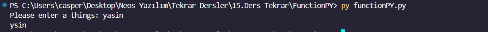
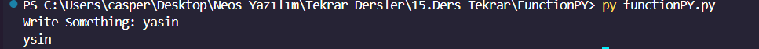

<h1><i>FUNCTIONS PYTHON</i></h1>

writeToTheScreen function: This function takes an input from the keyboard. If the length of the input is even, it removes the 'p' and 't' characters from the input and prints the remaining string. If the length of the input is odd, it removes the 'a' and 'e' characters and prints the remaining string. The resulting new value is printed to the screen.

writeToTheScreen2 function: This function returns a string, "returning a value". However, it seems that there's a mistake in the code where it's called, as the returned value is intended to be printed to the screen but a wrong syntax is used. The correct usage should be print(writeToTheScreen2()).

nameSurname function: This function concatenates the given name and surname obtained from the keyboard input and either prints the result or returns it as a value. It takes two parameters: name and surname, which can be passed to the function in either default order or by specifying their names.

deleteLetter function: This function removes specific characters from the given input string obtained from the keyboard and returns the remaining string. If the length of the input string is even, it removes the 'p' and 't' characters; if it's odd, it removes the 'a' and 'e' characters.

